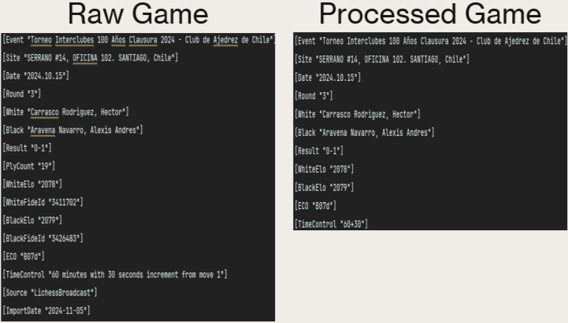

# Project Description
This project designs a distributed batch-processing system for large-scale chess game analytics.   
It consolidates and normalizes chess game archives from multiple sources, including online play   
(Lichess PGN archives) and historical professional databases, in order to consolidate key information such as opening  
frequencies correlation to skill rating.

## Setup:
1. Move directories in docs/MockData to root/data/raw. They contain truncated game data from actual runs.
   - The lichess data can be downloaded from https://database.lichess.org/#standard_games; files can be up to 900GB when unzipped, so I recommend using the example data.
   - The over the board data can be downloaded at https://lumbrasgigabase.com/en/download-in-pgn-format-en/
2. Install and setup Docker Desktop https://www.docker.com/get-started/
3. Open Docker Desktop to run Docker engine
## Environment Setup:
1. The environment is set up in dockerfile and docker compose yaml. Do not alter them.

## Schema:

| Field | Data Type | Nullable|
|---|---|---|
|Event|String|Yes|
|UTC_Date|String|Yes|
|UTC_Time|String|Yes|
|Time_Control|String|Yes|
|White_Player|String|Yes|
|Black_Player|String|Yes|
|White_Elo|Integer|Yes|
|Black_Elo|Integer|Yes|
|Result|String|Yes|
|Moves|String Array|Yes|
|Move_Count|Integer|Yes|
|ECO|String|Yes|
|Round|String|Yes|
|Rating_Type|String|Yes|


## How To Run:
1. Run file reduction script (Not required for example run).
```  
python src/ingestion/reduce_file.py  
```  
2. Build and run docker container in project terminal
```  
docker compose up --build  
```  
3. More succinct logs than in terminal can be found in logs/pipeline.logs.
4. To see example of data stored in MongoDB, run:
```  
python src/storage/test_mongo.py  

```  

## Sample Output:

## Project Status:
The data pipeline has been implemented end to end.
